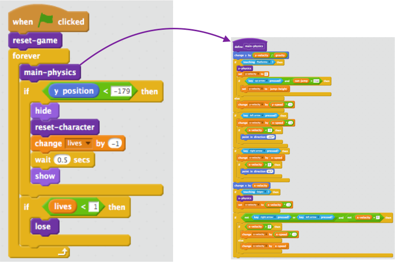

## Setting things up

Because you’re learning Scratch and not how to build a physics engine (code that makes things behave at least a little like the real world — e.g. not falling through floors), you’ll be starting with a project I’ve created that already has the basics for moving, jumping, and detecting platforms built in.

You should take a quick look at it including the details on this card, since you’ll be making some changes to it later, but you don’t need to understand everything it’s doing.

+ The first thing you’ll need to do is to get a copy of the code from [dojo.soy/platform-starter2](http://dojo.soy/platform-starter2){:target="_blank"} 

The physics engine of the game has a variety of pieces in it, some of which work right now and some of which don’t. You can find out which by running the game and trying to play it.

You'll see that you can lose lives, but nothing happens when you run out. Also, the game has only got one level, one type of thing to collect, and no enemies. You’re going to fix all of that, and a bit more!

+ For now, take a look at how the code is put together. It uses lots of **More** blocks, which are great for splitting your code up into pieces so you can manage it better. It’s like having a block made up of a lot of other blocks, which you can give some basic instructions to.

In the code above, the main game `forever`{:class="blockcontrol"} loop calls the `main-physics`{:class="blockmoreblocks"} block to do a whole lot of stuff! Keeping them separated like this makes it easy to read the main loop and understand what happens when, without worrying about **how** it happens.
 

+ Now look at `reset game`{:class="blockmoreblocks"} and `reset character`{:class="blockmoreblocks"} blocks and notice:
    1. They do pretty normal things, such as setting up variables and making sure the character rotates properly
    2. `reset-game`{:class="blockmoreblocks"} **calls** `reset-character`{:class="blockmoreblocks"} — meaning you can use a **More** block inside another **More** block!
    3. `reset-character`{:class="blockmoreblocks"} gets used in two different places, but to change it you only have to change the code of the **More** block in one! This can save you a lot of work and help you avoid mistakes.
