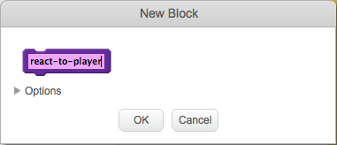
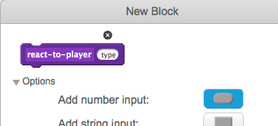

## Power-ups

At the moment you have just one type of collectible: a fart cloud that gains you one point when you grab it. On this card, you’re going to create a new type of collectible, in a way that will make adding other types of collectibles easy. Then you can invent your own power-ups and bonuses and really make the game your own!

I’ve already included some pieces to do this with the `collectable-type`{:class="blockdata"} variable and the `pick-costume`{:class="blockmoreblocks"} **More** block. You’re going to need to improve on them though. 

Let's have a look at how the collectible works right now.

+ In the scripts for the `Collectable` sprite, find the `when I start as a clone`{:class="blockevents"} code. The blocks you should look at are the ones that give you points for collecting a fart:

```blocks
    if <touching [Player Character v]?> then
        change [points v] by (collectable-value)
        delete this clone
```

 and this one that selects a costume for the clone:

```blocks
    pick-costume (collectable-type) :: custom
```

--- collapse ---
---
title: How does picking a costume work?
---

The `pick-costume`{:class="blockmoreblocks"} block works a bit like the `lose`{:class="blockmoreblocks"} block, but it has something extra: it takes an **input** variable called `type`.

```blocks
    define pick-costume (type)
    if <(type) = [1]> then
        switch costume to [fartCloud v]
    end
```
    
When the `pick-costume`{:class="blockmoreblocks"} block runs, what it does is this:

 1. It looks at the `type` input variable
 1. If the value of `type` is equal to `1`, it switches to the `fartCloud` costume

Take a look at the part of the script that uses the block:

```blocks
    when I start as a clone
    pick-costume (collectable-type) :: custom
    show
    repeat until <(y position) > [170]>
        change y by (collectable-speed)
        if <touching [Player Character v]?> then
            change [points v] by (collectable-value)
            delete this clone
```

You can see that the `collectable-type`{:class="blockdata"} variable gets **passed** to the `pick-costume`{:class="blockmoreblocks"} block. Inside the code for `pick-costume`{:class="blockmoreblocks"}, `collectable-type`{:class="blockdata"} is then used as the input variable (`type`).

--- /collapse ---

### Add a costume for the new power-up

Of course, right now the `Collectable` sprite only has one costume, since there's only one type of collectable. You're about to change that!

+ Add a new costume to the `Collectable` sprite for your new power-up. I've drawn a supersize fart cloud, but you can make whatever you like!

+ Next you need to tell the `pick-costume`{:class="blockmoreblocks"} **More** block to set the new costume whenever it gets the new value for `type`, like this \(using whatever costume name you picked\): 

```blocks
    define pick-costume (type)
    if <(type) = [1]> then
        switch costume to [fartCloud v]
    end
    if <(type) = [2]> then
        switch costume to [superFart v]
    end
```

### Create the power-up code

Now you need to decide what the new collectable will do. We’ll start with something simple: giving the player a new life. On the next card, you’ll make it do something cooler. 

+ Go into the **More** section and click **Make a Block**. Name the new block `react-to-player`{:class="blockmoreblocks"}.



+ Expand the **Options** section and add a **number input**. Name it `type`.



+ Click **OK**. 

+ Make the `react-to-player`{:class="blockmoreblocks"} block either increase the points or increase the player’s lives, depending on the value of `type`.  

```blocks
    define react-to-player (type)
    if <(type) = [1]> then
        change [points v] by (collectable-value)
    end
    if <(type) = [2]> then
        change [lives v] by [1]
    end
```

+ Update the `when I start as a clone`{:class="blockevents"} code to replace the block that adds a point with a **call** to `react-to-player`{:class="blockmoreblocks"}, **passing** `collectable-type`{:class="blockdata"}. By using this **More** block, normal fart clouds still add a point, and the new power-up adds a life. 

```blocks
    if <touching [Player Character v] ?> then
        react-to-player (collectable-type) :: custom
        delete this clone
    end
```

### Using `collectable-type`{:class="blockdata"} to create different collectables at random

Right now, you might be wondering how you'll tell each collectable the game makes what type it should be.

You do this by setting the value of `collectable-type`{:class="blockdata"}. This variable is just a number. As you've seen, it's used to tell the `pick-costume`{:class="blockmoreblocks"} and `react-to-player`{:class="blockmoreblocks"} blocks what costume, rules, etc., to use for the collectable. 

--- collapse ---
---
title: Working with variables in a clone
---

For each clone of the `Collectable` sprite, you can set a different value for `collectable-type`{:class="blockdata"}. 

Think of it like creating a new copy of the `Collectable` sprite using the value that is stored in `collectable-type`{:class="blockdata"} at the time `Collectable` clone gets created. 

One of the things that makes clones special is that they cannot change the values of any variables they start with. They effectively have **constant** values. That means that when you change the value of `collectable-type`{:class="blockdata"}, this doesn't affect the `Collectable` sprite clones that are already in the game.

--- /collapse ---

You're going to set the `collectable-type`{:class="blockdata"} to either `1` or `2` for each new clone that you make. Let's pick the number at random, to make a random collectable every time and keep things interesting. 

+ Find the `repeat until`{:class="blockcontrol"} loop inside the green flag code for the `Collectable` sprite, and add the `if...else`{:class="blockcontrol"} code shown below.

```blocks
    repeat until <not <(create-collectables) = [true]>>
        if <[50] = (pick random (1) to (50))> then
            set [collectable-type v] to [2]
        else
            set [collectable-type v] to [1]
        end
        wait (collectable-frequency) secs
        go to x: (pick random (-240) to (240)) y: (-179)
        create clone of [myself v]
```

This code gives a 1 in 50 chance of setting the `collectable-type`{:class="blockdata"} to `2`.

Great! Now you have a new type of collectable that sometimes shows up instead of the fart cloud, and that gives you an extra life instead of a point when you collect it!
