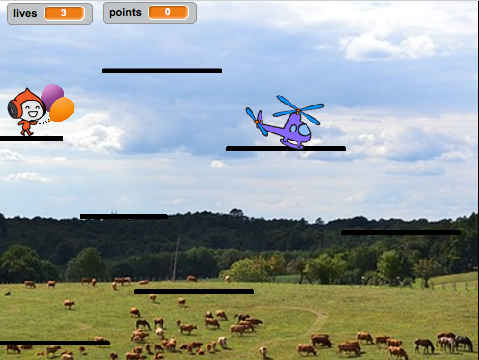

## Adding some competition

Your game works and now you can collect points, get special powers from power-ups, and lose. We’re getting somewhere! Maybe it’d be fun to add some competition though — what about including a character that moves around a little, but that you're not supposed to touch? This will be similar to enemies in the traditional platformer games \(like Super Mario\) that we’re being inspired by here.

+ First, pick a sprite to add as your enemy. Because our player character is in the sky, I chose a helicopter. There are lots of other sprites you could add though. I also renamed the sprite to `Enemy`, just to make things clearer for me.

+ Resize the sprite to the right size and place it somewhere appropriate to start. Here’s what mine looks like: 



+ Write the easier code first: set up its block for the `game over` message to make the enemy disappear when the player loses the game. 

```blocks
    when I receive [game-over v]
    hide
```

+ Now you need to write the code for what the enemy does. You can use mine from this card, but don’t be afraid to add more! (What if they teleport around to different platforms? Or what if there’s a power-up that makes them move faster, or slower?) 

```blocks
    when green flag clicked
    show
    set [enemy-move-steps v] to [5]
    set rotation style [left-right v]
    go to x: (1) y: (59)
    forever
        move (enemy-move-steps) steps
        if <not <touching [Platforms v] ?>> then
            set [enemy-move-steps v] to ((enemy-move-steps) * (-1))
        end
    end
```

**Note**: if you just drag the `go to`{:class="blockmotion"} block and don’t change the `x` and `y` values, they’ll be the values for the current location of the sprite!
 
The code in the `if...then`{:class="blockcontrol"} block will make the enemy turn around when they get to the end of the platform!

The next thing you’ll need is for the player to lose a life when they touch the enemy. You need to make sure they **stop** touching really quickly, though, since otherwise the touching code will keep running and they’ll keep losing lives. 

+ Here's how I did it, but feel free to try to improve on this code! I modified the `Player Character` sprite’s main block. Add the code before the `if`{:class="blockcontrol"} block that checks if you're out of lives.

```blocks
    if <touching [Enemy v] ?> then
        hide
        go to x: (-187) y: (42)
        change [lives v] by (-1)
        wait (0.5) secs
        show
    end
```

--- collapse ---
---
title: Show me the whole updated script
---

My `Player Character` sprite's main block looks like this now:

```blocks
    when green flag clicked
    reset-game :: custom
    forever
        main-physics :: custom
        if <(y position) < [-179]> then
            hide
            reset-character :: custom
            change [lives v] by (-1)
            wait (0.05) secs
            show
        end
        if <touching [Enemy v] ?> then
            hide
            go to x: (-187) y: (42)
            change [lives v] by (-1)
            wait (0.5) secs
            show
        end
        if <(lives) < [1]> then
            lose :: custom
        end
    end
```

--- /collapse ---

The new code hides the character, moves them back to their starting position, reduces `lives` by `1`, and after half a second makes them re-appear.
