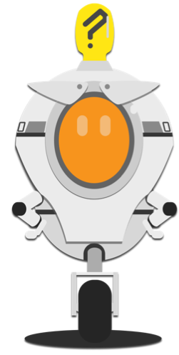

## What next?

You’ve got a complete game now, but there’s a whole lot more you can do with it! Here are a few ideas to get you started:
 
--- collapse ---
--- 
title: High scores
---

+ Keep a list of the names and scores of people who’ve gotten high scores in the game! You’ll need to use the `ask`{:class="blocklooks"} block to the get their name.

--- /collapse ---

--- collapse ---
--- 
title: New power-ups!
---

+ Try adding some new power-ups, for example:
  * Immunity to enemies
  * More lives
  * Bigger player character
  * Smaller player character
 
--- /collapse ---

--- collapse ---
--- 
title: Scrolling levels!
---

+ Can you figure out how to make the levels scroll along, so the player character can move through them from left to right? Or at least make it _look_ like that’s what’s happening.
 
--- /collapse ---

--- collapse ---
--- 
title: Completing levels!
---

+ Right now, the levels never end. What if, instead of pushing a button, you needed a certain number of points to get to the next level?
 
--- /collapse ---

--- collapse ---
--- 
title: Play With physics!
---

+ Try changing some of the values in the physics engine, like the `gravity`, `jump height`, `x-speed`, and `y-speed`. How do they change the game?

+ Can you use the physics to make power-ups?
 
--- /collapse ---

--- collapse ---
--- 
title: More levels
---

+ Add more levels! Make better art! Use the Stage background to make the game look cooler while still keeping platforms easy to work with for you as the coder.
 
--- /collapse ---

--- collapse ---
--- 
title: Sound effects!
---

+ This game is totally silent right now! Try adding background music and sound effects using the blocks in the **Sound** section!
 
--- /collapse ---

--- collapse ---
--- 
title: Secrets!
---

+ Think of secret bonuses, cheat codes, and other 'easter eggs' you can hide in the game for players to discover. Try to code some of them!
 
--- /collapse ---

--- collapse ---
--- 
title: Different characters!
---

+ Let the player pick a character. Make them different in attributes like size, how high they jump, maybe even how many lives they have and how many points they get from collectables! 

--- /collapse ---

 
